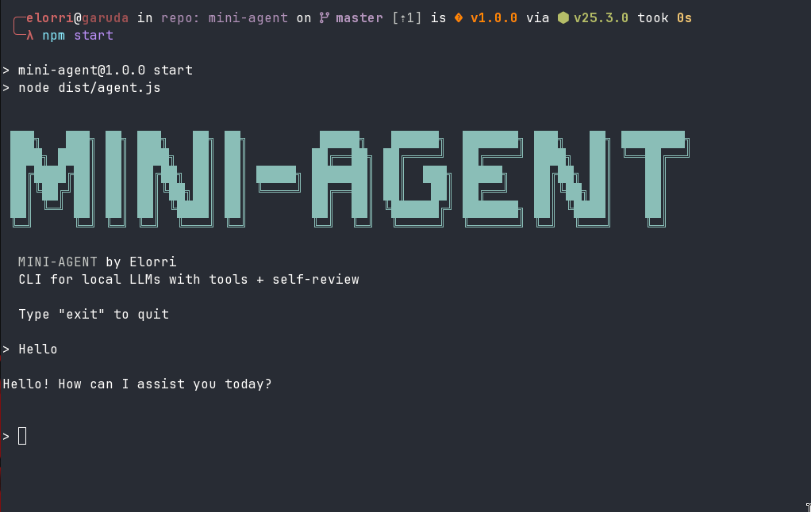

# mini-agent

A work-in-progress CLI agent designed to work with small language models (6.7B-13B parameters) running locally via OpenAI-compatible APIs like Ollama.



## Project Overview

This project is a **work in progress** that aims to build an intelligent CLI agent capable of:

- Using **local models** served via OpenAI-compatible API (e.g., Ollama with `deepseek-coder:6.7b`)
- Orchestrating the model with **agent logic** (tools + self-review)
- Implementing **real tools** for file system operations, code analysis, and error debugging
- A **"Ralph Wiggum" self-review mode** that checks and refines model responses

## Why Small Models?

This project specifically targets small models (6.7B to 13B parameters) because:

- They can run **locally** on consumer hardware (no GPU required for 6.7B models)
- They have **low latency** and **zero API costs**
- They are **privacy-friendly** (all processing stays local)
- With proper prompting and tools, they can be surprisingly effective

## The Model

Currently configured to work with:

- **Model**: `deepseek-coder:6.7b` (or any Ollama model with OpenAI-compatible API)
- **API Base**: `http://localhost:11434/v1` (default Ollama port)
- **Temperature**: 0.3 (for consistent responses from smaller models)

### Recommended Models

| Model | Size | Notes |
|-------|------|-------|
| deepseek-coder:6.7b | 6.7GB | Excellent for coding tasks |
| qwen2.5-coder:7b | 7GB | Good general coding |
| codellama:7b | 7GB | Meta's code model |
| llama3.2:3b | 3GB | Lightweight general model |

## Architecture

```
User Input
    |
    v
[Agent] - Detect if skill needed?
    |
    +-- Yes --> [Execute Skill]
    |              +-- Multiple tools automatically
    |              +-- Context enrichment
    |              +-- Ralph review
    |
    +-- No --> [Call Model]
                   |
                   +-- Tool Call? --> [Handle Tool] + Ralph
                   |
                   +-- Direct Response? --> Ralph review
    |
    v
Final Response
```

## Available Tools

### read_file
Reads file content from the filesystem.

```json
{ "tool": "read_file", "args": { "path": "./src/agent.ts" } }
```

### list_dir
Lists files and directories in a given path.

```json
{ "tool": "list_dir", "args": { "path": "./src" } }
```

### search_in_file
Searches for patterns (regex) in files.

```json
{ "tool": "search_in_file", "args": { "path": "./src", "pattern": "async function" } }
```

### run_command
Executes shell commands and returns output.

```json
{ "tool": "run_command", "args": { "command": "npm run build" } }
```

### extractPackageJsonDeps
Special handler for extracting dependencies from package.json without model intervention.

## Available Skills

Skills are **high-level workflows** that combine multiple tools for complex tasks.

### analyze_project
Analyzes the complete project structure.

**When to use:**
- Understanding new project architecture
- Dependency audits
- Checking build status

**Example:** _"Analyze the project structure"_

**Flow:**
1. List directory contents
2. Read package.json
3. Search for source files
4. Run build command
5. Ralph reviews the final analysis

### debug_error
Debugs specific errors by finding location and root cause.

**When to use:**
- Build errors
- Import/module issues
- Runtime errors

**Example:** _"Error: Cannot find module 'express'"_

**Flow:**
1. Search for error pattern in source
2. Read matched files
3. Try to reproduce (npm test/build)
4. Ralph reviews the solution

### resolve_dependencies
Resolves dependency and import issues.

**When to use:**
- Version conflicts
- Missing modules
- Clean up unused dependencies

**Example:** _"I have missing module errors"_

**Flow:**
1. Read package.json
2. Run npm list
3. Search for imports in source
4. Run build to detect errors
5. Ralph reviews the solution

## The Ralph Wiggum Skill

Ralph is a **self-review mechanism** inspired by Ralph Wiggum from The Simpsons. It's not a traditional skill but a **quality assurance layer** that:

1. Takes the model's proposed response
2. Asks the model itself to evaluate if the response is correct
3. Returns a verdict: `OK` or `RETRY`
4. If `RETRY`, provides feedback for improvement
5. Iterates up to 7 times (configurable) until `OK`

### How Ralph Works

```typescript
// Ralph loop pseudocode
for i in 0..maxLoops:
    answer = callModel(messages)
    review = reviewAnswer(question, answer, context)
    
    if review.verdict === 'OK':
        return answer
    
    // Add feedback for next iteration
    messages.push({
        role: 'system',
        content: `Fix this based on feedback: ${review.feedback}`
    })
    messages.push({ role: 'assistant', content: answer })

return answer  // Return even if not perfect
```

### Ralph Configuration

```typescript
MAX_REVIEW_LOOPS: 7     // Maximum iterations
TEMPERATURE: 0.3        // Low temperature for consistency
```

### Why Ralph?

Small models can:
- Make factual errors
- Hallucinate information
- Miss context details

Ralph helps by:
- Catching obvious mistakes
- Ensuring responses are grounded in actual tool output
- Providing iterative improvement

## Project Structure

```
mini-agent/
├── src/
│   ├── agent.ts         # Main REPL loop and orchestration
│   ├── config.ts        # Centralized configuration
│   ├── tools.ts         # Tool implementations (low-level)
│   ├── skills.ts        # Skill implementations (high-level)
│   └── reviewer.ts      # Ralph review logic
├── skills/              # Skill documentation
│   ├── README.md        # Skills guide
│   ├── DISCOVERY.md     # How skills are detected
│   ├── TEMPLATE.md      # Template for new skills
│   ├── analyze-project.md
│   ├── debug-error.md
│   └── resolve-dependencies.md
├── dist/                # Compiled JavaScript
├── package.json
└── tsconfig.json
```

## Getting Started

### Prerequisites

- Node.js 18+
- Ollama (or any OpenAI-compatible local API server)
- A local LLM model (recommended: `deepseek-coder:6.7b`)

### Installation

```bash
npm install
npm run build
```

### Running

```bash
# Set environment variables (optional)
export OLLAMA_API_BASE=http://localhost:11434/v1
export OLLAMA_MODEL=deepseek-coder:6.7b

# Start the agent
npm start
# or
node dist/agent.js
```

### Example Session

```
Agente Vercel+Ollama (type "exit" to quit)

> Analyze the project structure
[SKILL DETECTADO: analyze_project]

[STEP 1 - Structure]
/home/user/mini-agent/src:
agent.ts
config.ts
tools.ts
skills.ts
reviewer.ts

[STEP 2 - Dependencies]
package.json declares dependencies: (none)
and devDependencies: @types/node, typescript

[STEP 3 - Build Status]
> tsc
(no errors)

> exit
Goodbye!
```

## Extending the Agent

### Adding New Tools

Add tools in `src/tools.ts`:

```typescript
export async function myTool(args: { param: string }): Promise<string> {
    // Tool implementation
    return `Result: ${args.param}`;
}
```

### Adding New Skills

1. Create documentation in `skills/my-skill.md`
2. Implement in `src/skills.ts`:

```typescript
export async function skill_my_skill(
    messages: ChatMessage[],
    question: string,
): Promise<string> {
    const results: string[] = [];
    // Execute multiple tools
    const result = await readFileTool({ path: './config.json' });
    results.push(result);
    
    const context = results.join('\n');
    const messagesWithContext: ChatMessage[] = [
        ...messages,
        { role: 'tool', name: 'skill_my_skill', content: context },
        { role: 'user', content: question },
    ];
    
    return await ralphLoop(messagesWithContext, question, context);
}
```

3. Register in `AVAILABLE_SKILLS` in `skills.ts`

## Configuration

All configuration is centralized in `src/config.ts`:

```typescript
export const CONFIG = {
    API_BASE: process.env.OLLAMA_API_BASE || 'http://localhost:11434/v1',
    MODEL_NAME: process.env.OLLAMA_MODEL || 'deepseek-coder:6.7b',
    MAX_FILE_SIZE: 8000,
    MAX_CONTEXT_TOKENS: 2000,
    MAX_REVIEW_LOOPS: 7,
    REQUEST_TIMEOUT: 30000,
    TEMPERATURE: 0.3,
};
```

## Environment Variables

```bash
# API endpoint (default: http://localhost:11434/v1)
OLLAMA_API_BASE=http://localhost:11434/v1

# Model name (default: deepseek-coder:6.7b)
OLLAMA_MODEL=deepseek-coder:6.7b
```

## Current Limitations

This is a **work in progress** project:

- Limited to simple tool calls (no complex tool chaining)
- Ralph adds latency (extra model calls for review)
- Small models may struggle with complex reasoning
- No streaming support yet
- CLI only (no web interface)

## Future Improvements

- [ ] CLI flags for model selection, Ralph disable
- [ ] Dynamic skill loading from external files
- [ ] Skill marketplace/repository
- [ ] Web interface
- [ ] Streaming support
- [ ] Session persistence

## License

MIT - Experimental project for learning and exploration of local AI agents.

## Development

This project was developed using **VSCode** with the assistance of **MiniMax** AI model.

### Banner

The ASCII art banner was generated using [oh-my-logo](https://github.com/shinshin86/oh-my-logo):

```bash
npx oh-my-logo "MINI-AGENT" sunset --filled --block-font block
```

## Acknowledgments

- [Ollama](https://ollama.com/) - For making local models accessible
- [Vercel AI SDK](https://sdk.vercel.ai/) - Architecture inspiration
- Ralph Wiggum - For the review mechanism naming
- [oh-my-logo](https://github.com/shinshin86/oh-my-logo) - For the stunning CLI banner generator

